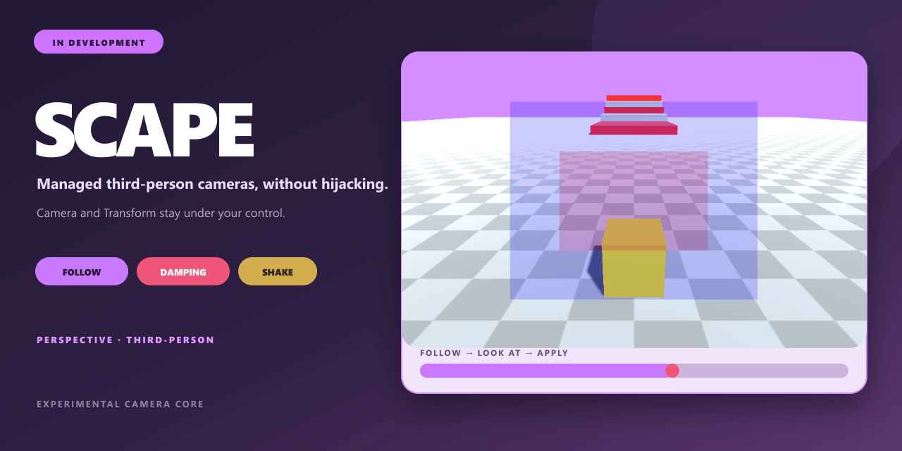

# Scape

[English](README.md)

轻量 Unity 3D 第三人称相机库。



## 项目包含什么

- 第三人称相机行为。
- 可复用 Unity 包。
- 运行时示例。

## 快速开始

在 Unity 中打开 **Window → Package Manager**，选择 **Add package from git URL**，输入：

```text
https://github.com/onovich/Scape.git?path=/Assets/com.tenon.scape#main
```

包元数据声明支持 Unity `2019.4` 及以上版本。

仓库本身也可以作为 Unity 示例工程打开。

## 示例

```csharp
// Create And Init Camera

void Start() {
    // Camera
    cameraCore = new Camera3DCore();
    var t = agent.transform.position;
    var r = agent.transform.rotation;
    var s = agent.transform.localScale;
    var fov = agent.fieldOfView;
    var nearClip = agent.nearClipPlane;
    var farClip = agent.farClipPlane;
    var aspectRatio = agent.aspect;
    var screenWidth = screenSize.x;
    var cameraID = cameraCore.CreateTPCamera(t, r, s, fov, nearClip, farClip, aspectRatio, screenWidth);

    // Damping Factor
    cameraCore.SetTPCameraFollowDamppingFactor(followDampingFactor);
    cameraCore.SetTPCameraLookAtDamppingFactor(lookAtDampingFactor);

    // Dead Zone
    cameraCore.SetTPCameraDeadZone(deadZoneFOV);

    // Soft Zone
    cameraCore.SetTPCameraSoftZone(softZoneFOV);

    // Offset
    cameraCore.SetPersonOffset(t, r, s);

    // Follow Mode
    cameraCore.SetTPCameraFollowX(followX);
}
```

## 仓库结构

- `Assets/` — Unity 脚本、场景、包与项目资源。
- `Packages/` — Unity 包依赖。
- `ProjectSettings/` — Unity 工程配置。

## 相关项目

- [Vista](https://github.com/onovich/Vista)
- [Swing](https://github.com/onovich/Swing)

## 当前状态

Scape 仍在开发中，不建议用于正式项目。当前只覆盖透视第三人称相机，多项手动控制、区域、跟踪和转场功能尚未完成。

## 许可证

本仓库采用 [MIT](LICENSE) 许可证。
